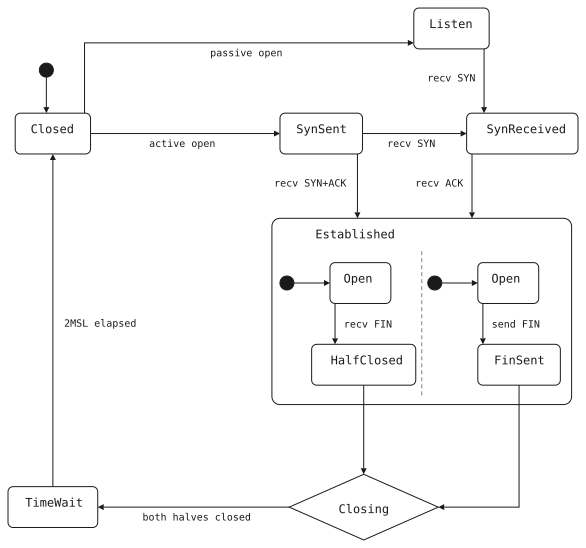

# scav

scav is a statechart authoring, layout and rendering tool, written in C++.

[How scav lays out a statechart](https://charlesnicholson.github.io/scav/) explains the
layout with interactive figures.

[Building and developing scav](docs/development.md) · [Licence](docs/development.md#licence)
